# One-week marketing and clinic evaluation demo plan

**Target:** Wednesday, August 19, 2026
**Status:** Proposed for review. This plan does not approve production data, metrics, rankings, or decision authority.

## What the demo should do

The tool should accept a loosely phrased marketing or clinic question and guide it through a visible decision workflow:

| Stage | What the system does | What the user sees |
| --- | --- | --- |
| 1. Clarify | AI rewrites a vague question into a specific, measurable decision question | Original question, proposed rewrite, assumptions, and a chance to revise or confirm |
| 2. Recommend evidence | The system determines which measures, time periods, geographic units, comparisons, and controls would answer the rewritten question | Required evidence checklist and why each item matters |
| 3. Match available evidence | The system compares the required evidence with the snapshot catalog | Available, missing, stale, restricted, incompatible, and substitute sources |
| 4. Evaluate | Deterministic methods calculate market or location differences, baselines, controls, rankings, and sensitivity | Question-specific map, ranked locations, evidence views, and confidence |
| 5. Prepare action | AI explains the validated result without inventing calculations or causal claims | A stakeholder-ready action packet with next steps, owners, measures, limitations, and human approvals |

The AI may propose and explain. Application logic validates evidence, geography, calculations, rankings, and permitted actions.

## Feature dependency map

The editable dependency graph is available in [FigJam](https://www.figma.com/board/103Y7hliIwGQgv50EMyi2Z).

```mermaid
flowchart LR
    question[Stakeholder question] --> classify[Classify domain and quality]
    classify --> rewrite[Propose measurable rewrite]
    catalog[Evidence catalog] -.->|Feasibility context| rewrite
    rewrite --> confirm{Material assumptions?}
    confirm --> intent[Confirmed QuestionIntent]
    intent --> required[Recommend ideal evidence]
    snapshots[(Offline source snapshots)] --> catalog
    required --> match[Match available evidence]
    catalog --> match
    match --> enough{Evidence sufficient?}
    enough -->|No| needs[Needs evidence]
    needs --> input[Human files or definitions]
    input --> validate[Validate and map input]
    validate --> match
    enough -->|Yes| contract[EvaluationContract]
    intent --> contract
    contract --> baseline[Select fair baseline]
    baseline --> controls[Apply approved controls]
    controls --> method[Select governed operator]
    method --> calculate[Deterministic evaluation]
    calculate --> rank[Question-specific ordering]
    rank --> views[Map and location detail]
    calculate --> finding[Validated finding]
    views --> finding
    finding --> confidence[Confidence and limitations]
    confidence --> packet[ActionPacket]
    packet --> review{Stakeholder review}
    review -->|Approve bounded test| outcome[Measure outcome]
    review -->|Revise| packet
    outcome -.->|Improves blueprint| catalog
```

### Feature dependency matrix

| Feature | Hard dependencies | Informational dependencies | Unlocks |
| --- | --- | --- | --- |
| Classify the question | Domain taxonomy and supported decision blueprints | Example stakeholder questions | Routes the request to marketing, clinic, mixed, clarification, or unsupported |
| Rewrite the question | Question-quality rules and decision-blueprint fields | Evidence catalog for feasibility only | A specific proposed decision question with visible assumptions |
| Confirm intent | Proposed rewrite and material ambiguities | Prior approved examples | Stable `QuestionIntent` that downstream work may rely on |
| Recommend ideal evidence | Confirmed intent, outcome, entity, baseline, period, and geography | Method library | Evidence requirements based on the decision rather than current availability |
| Catalog available evidence | Snapshot manifests, metric definitions, geography, freshness, and allowed use | Tableau documentation and source-owner guidance | A trustworthy inventory of what the demo can use |
| Match evidence | Ideal evidence plan and evidence catalog | Compatible fallback policy | Available, substitute, missing, stale, incompatible, and restricted evidence states |
| Accept human evidence | Selected workflow step and permitted file types | Suggested missing evidence | A path to improve question context or fill a structured evidence gap |
| Compile evaluation contract | Confirmed intent and sufficient compatible evidence | Human definitions and action boundaries | Baseline, controls, operator, sources, limitations, and planned views |
| Select baseline | Entity cohort, period, eligibility, and comparison policy | Stakeholder preference | Meaningful better/worse comparison rather than an isolated value |
| Apply controls | Approved denominators, maturity, scale, customer mix, spend, or channel rules | Data-quality thresholds | A fairer comparison and explicit confounding boundaries |
| Run evaluation | Valid contract, compatible evidence, baseline, controls, and deterministic operator | AI-generated explanation plan | Validated differences, sensitivity, and structured results |
| Order locations | Structured results, approved ordering rule, compatible geography, and minimum data | Map geometry | Question-specific priority order with reason codes |
| Render map and location detail | Ordered results, geography, evidence views, and location identifiers | User-selected comparison layers | Visual exploration and location-specific findings |
| Generate finding | Structured evaluation results and contrary evidence | AI explanation template | Reviewable statement of difference, drivers, controls, and uncertainty |
| Calculate confidence | Evidence quality, method validity, sensitivity, and action feasibility | Human constraints | Separate data, method, robustness, and action confidence |
| Prepare action packet | Validated finding, location detail, confidence, permitted actions, owner, and KPI | Stakeholder format preference | Actionable next steps with guardrails, limitations, and human requests |
| Learn from outcome | Approved action packet, recorded human decision, outcome definition, and maturity window | Override rationale | Evidence for improving a reviewed blueprint later |

The evidence catalog has a dotted dependency into question rewriting because it informs feasibility. It must not overwrite the intended decision. Confirmed intent defines the ideal evidence; availability determines whether the evaluation can proceed, needs a substitute, or must ask for more input.

## Question clarification contract

AI should rewrite a question when it is too broad, ambiguous, not measurable, missing a stakeholder decision, or missing a geographic and time boundary.

Example:

| Input | Proposed rewrite |
| --- | --- |
| “Where should we spend more on marketing?” | “Which U.S. DMAs have lower paid-search coverage than comparable markets, sufficient eligible-customer scale, and recent conversion efficiency that supports a controlled budget test during the next four weeks?” |
| “Which clinics need help?” | “Which mature clinics underperform their comparable baseline on sales and visits after adjusting for clinic age and local household opportunity, and which controllable factors should be investigated next?” |

The rewrite should produce a visible `QuestionIntent`:

| Field | Meaning |
| --- | --- |
| Stakeholder | Who will use the result |
| Decision | What choice or action they are considering |
| Entity | Market, DMA, clinic, ZIP, trade area, or other unit being compared |
| Outcome | The KPI the stakeholder wants to improve |
| Baseline | Own history, comparable locations, model expectation, experiment control, or target |
| Period | Observation period and decision horizon |
| Geography | Actionable geographic unit, not merely the available map shape |
| Controls | Scale, customer mix, maturity, spend, channel, or other fairness adjustments |
| Allowed action | What the system may recommend for human review |
| Ambiguities | Material assumptions still needing confirmation |

If the rewrite materially changes the intended decision, the user must confirm it before evaluation. Minor wording improvements may continue with assumptions shown.

## Evidence recommendation and availability

After clarification, the system should show the ideal evidence plan before showing what is currently available. This prevents the available data from silently redefining the question.

| Evidence state | System behavior |
| --- | --- |
| Available | Use it with source, period, grain, definition, and extraction date shown |
| Substitute available | Explain why the substitute is semantically compatible and how confidence changes |
| Missing | Tell the user which file, field, definition, or owner could fill the gap |
| Stale | Allow use only when policy permits, label the date, and downgrade confidence |
| Incompatible geography | Do not join silently; request a crosswalk or recommend a different evaluation grain |
| Restricted | Show that the source exists without exposing restricted values |
| Definition unresolved | Ask which metric variant is authoritative before calculating |

The user may attach CSV, Excel, PDF, Word, Markdown, or text evidence to the relevant step. For the demo, structured data files should be validated and mapped through an explicit preview. Documents may inform question interpretation and limitations, but must not silently become numeric observations or scoring rules.

## Final action packet

The final result is not just an insight paragraph. It is a typed, inspectable action packet for the stakeholder.

| Section | Required contents |
| --- | --- |
| Decision | Stakeholder, decision being considered, scope, geography, and time horizon |
| Finding | How market or clinic **G** differs from baseline **B** by **Y** |
| Drivers | Factors **Z** associated with the difference and contrary evidence |
| Controls | How scale, customer mix, spend, maturity, or other factors **C** were handled |
| Priority locations | Question-specific ordered locations with reason codes, not a universal score |
| Recommended action | Bounded test, investigation, or change **A** that the stakeholder can review |
| Measurement | KPI **K**, guardrails, owner, period, success threshold, and stop/revise condition |
| Confidence | Data, method, robustness, and action confidence shown separately |
| Limitations | Missing evidence, weak comparisons, incompatible grains, staleness, and causal boundaries |
| Human requests | Exact questions, evidence, definitions, and approvals needed next |
| Traceability | Question rewrite, evidence receipts, calculations, sources, and versions |

Target narrative:

> For decision **X**, market **G** differs from comparable baseline **B** by **Y**. The difference is associated with **Z**, remains meaningful after controlling for **C**, and is actionable through **A**. We recommend **test/change A**, measured using **K**, with confidence and constraints shown.

## Phase 1 — Clarify the question

**Dates:** August 11–12

| Dimension | Plan |
| --- | --- |
| Build | Question-quality check, marketing/clinic domain router, AI rewrite, visible assumptions, confirmation gate, and `Needs clarification` state |
| Initial blueprints | Regional marketing opportunity and clinic performance/opportunity |
| Unlocks | The prototype can accept broad wording without pretending the original question is already analytically valid |
| User experience | User asks a question, sees a specific proposed evaluation question, and confirms or edits it |
| End-of-phase demo | “Which clinics need help?” becomes a measurable comparison with stakeholder, outcome, baseline, period, geography, and controls |
| Test | 20 golden questions, 10 vague questions, and 10 unsafe or unsupported questions; every request must resolve to confirmed intent, clarification, or `Needs evidence` |
| You | Define representative questions, stakeholder actions, question-rewrite UI, and confirmation behavior |
| Partner | Confirm which questions can be supported by the fields expected in the data extracts |

## Phase 2 — Recommend and catalog evidence

**Dates:** August 11–13, in parallel with Phase 1

| Dimension | Plan |
| --- | --- |
| Build | Required-evidence planner, snapshot catalog, source manifests, canonical metrics, freshness rules, geography compatibility, and fallback policy |
| Sources | Google Ads, Conductor, Tableau, Snowflake, Census, clinic profiles, clinic sales/performance, and market crosswalks |
| Unlocks | The prototype can distinguish what would ideally answer the question from what is currently available |
| User experience | A checklist shows required data, available data, missing data, compatible alternatives, and suggested uploads or owners |
| End-of-phase demo | A marketing question shows Google Ads metrics as available, Conductor as missing or pending, and Snowflake customer/market context as a compatible snapshot |
| Test | Schema, unit, date, duplicate, missingness, definition, grain, and crosswalk checks; deliberately test one stale and one unavailable source |
| You | Evidence-plan schema, catalog UI, source selection rules, evidence states, and fallback explanations |
| Partner | SQL/export scripts, field mappings, data dictionaries, snapshot manifests, row-count reconciliation, and safe fixtures |

### Minimum snapshot metadata

Every data extract should contain or travel with:

| Required metadata | Example |
| --- | --- |
| Source and owner | Google Ads / Marketing Analytics |
| Extraction time | 2026-08-17 08:00 ET |
| Observation period | Previous 28 completed days |
| Metric definition | Conversions with named attribution setting |
| Unit and denominator | Acquired customers per $1,000 spend |
| Entity and geography | Campaign × DMA |
| Join keys | DMA code, campaign ID |
| Freshness threshold | Seven days |
| Missingness and coverage | 94% of mapped spend |
| Allowed use | Internal demo, aggregated analysis |
| Known caveats | Attribution lag and unmapped campaigns |

## Phase 3 — Compile the evaluation plan

**Dates:** August 12–14, in parallel with Phases 1 and 2

| Dimension | Plan |
| --- | --- |
| Build | Typed `EvaluationContract`, baseline selection, controls, measure compatibility, method selection, human blockers, and planned map views |
| Decision chain | Stakeholder → decision → entity → outcome → baseline → evidence → controls → method → action → measurement |
| Unlocks | The agent can explain how it intends to answer the question before running calculations |
| User experience | Progress steps show the decision interpretation, selected sources, baseline, controls, method, limitations, and evidence requests |
| End-of-phase demo | A confirmed clinic question produces a complete plan using clinic performance, profile, market household, income, and comparison-cohort evidence |
| Test | Snapshot-test the complete plan for every golden question; missing outcome, baseline, geography, or compatible evidence must produce a blocker |
| You | Orchestration state machine, typed contracts, human gates, plan explanation, and progress workflow |
| Partner | Metric compatibility, geography compatibility, expected evidence choices, and approved source priority |

The plan must be compiled backward from the final action packet:

1. What decision and action must the packet support?
2. What finding would justify investigating or testing that action?
3. What fair baseline and controls make that finding meaningful?
4. Which method can produce that finding without overclaiming?
5. Which evidence, grain, definition, and period does the method require?
6. Which required evidence is available, substitutable, or missing?
7. What must a human clarify or approve before execution?

## Phase 4 — Evaluate and order locations

**Dates:** August 13–14

| Dimension | Plan |
| --- | --- |
| Build | Deterministic descriptive, comparative, association, sensitivity, and question-specific ranking operators |
| Baselines | Own history, comparable markets/clinics, scale-adjusted expectation, approved target, or explicit treatment/control |
| Controls | Per-household, per-customer, per-spend, clinic maturity, channel mix, customer mix, and minimum-volume rules where approved |
| Unlocks | Supported questions produce validated differences, location ordering, associated drivers, confidence, and sensitivity |
| User experience | Map and ranked list update to the evaluation; users can inspect raw values, baseline differences, controls, and missing evidence |
| End-of-phase demo | The product orders clinics or markets for one supported marketing question and one clinic question, then explains why the order changes under an alternate baseline or evidence layer |
| Test | Hand-calculated fixtures, ranking ties, row-order stability, missing-data rejection, alternate peer groups, period sensitivity, and causal-language rejection |
| You | Operator implementation, plan-to-method policy, map/ranking rendering, confidence, and limitation output |
| Partner | Reference calculations, SQL parity checks, quality thresholds, representative fixtures, and expected results |

For Wednesday, this phase is limited to descriptive comparison, one explicit baseline pattern per blueprint, a small approved control set, and question-specific ordering. It may propose a test, but observational snapshots do not establish causality.

## Phase 5 — Generate the action packet and location detail

**Date:** Monday, August 17

| Dimension | Plan |
| --- | --- |
| Build | Structured `ActionPacket`, location drill-down, bounded recommendations, owners, KPI/guardrails, limitations, human requests, and evidence traceability |
| Unlocks | The result becomes useful to a stakeholder rather than ending as a map or analytical observation |
| User experience | User opens a prioritized location and sees the finding, baseline, drivers, next actions, measurement plan, confidence, sources, and questions for humans |
| End-of-phase demo | A marketing stakeholder receives a geo-test packet; a clinic stakeholder receives a local investigation packet with named follow-ups and measurement criteria |
| Test | Every numeric claim must resolve to a structured result; every action must have an owner, KPI, period, guardrail, limitation, and human approval boundary |
| You | Action-packet UI, location detail, AI explanation prompt, citation display, and end-to-end browser flows |
| Partner | Evidence receipts, expected location detail, data lineage, and validation that packet values reconcile to extracts |

### Example marketing action packet

| Field | Example output |
| --- | --- |
| Decision | Select DMAs for a four-week paid-search test |
| Finding | Market G has high eligible-customer scale but lower category search coverage than matched markets |
| Controls | Spend, customer scale, channel mix, and pre-period conversion rate |
| Action | Review Market G for a capped incremental-budget test |
| KPI | Incremental acquired customers and approved CCP metric |
| Guardrails | CPA ceiling, minimum conversion volume, no overlapping regional test |
| Human request | Confirm CCP variant, budget owner, attribution window, and experiment eligibility |

### Example clinic action packet

| Field | Example output |
| --- | --- |
| Decision | Prioritize mature clinics for local performance investigation |
| Finding | Clinic G trails its comparable baseline after adjusting for maturity and household scale |
| Drivers | Lower visits and local penetration are associated with the gap; staffing evidence is missing |
| Action | Review appointment availability, local awareness, staffing, and paid-local coverage before selecting an intervention |
| KPI | Visits, booking rate, sales, or another owner-approved clinic outcome |
| Guardrails | Comparable maturity, sufficient volume, no active operational disruption |
| Human request | Confirm clinic outcome, maturity rule, intervention owner, and current operational constraints |

## Phase 6 — Test failures and freeze the demo

**Dates:** August 18–19

| Dimension | Plan |
| --- | --- |
| Build | Snapshot preflight, cached demo bundle, model/network fallback, recovery states, final demo script, and claim audit |
| Unlocks | The prototype remains understandable when a source is missing, stale, incompatible, or unavailable |
| User experience | Instead of failing or fabricating, the tool explains what it can still answer, which fallback it used, and what evidence is needed next |
| End-of-phase demo | Supported marketing question, supported clinic question, question rewrite, human evidence, missing-source fallback, ranked map, location detail, and action packet |
| Test | Run the golden suite three times; remove one snapshot; disconnect the model/network; verify deterministic fallback and no invented results |
| You | Demo narrative, browser regression, orchestration fallback, UI polish, and claim audit |
| Partner | Snapshot preflight, reconciliation report, rerun instructions, recovery bundle, and final data freeze |

There is no planned work on Saturday, August 15 or Sunday, August 16. Freeze new capabilities by noon Tuesday, August 18. Use the remaining time for critical fixes and two full rehearsals.

## What is possible by Wednesday

| Capability | Wednesday target |
| --- | --- |
| Accept broad marketing and clinic wording | Yes |
| Rewrite vague questions into measurable proposals | Yes |
| Let the user confirm or correct material assumptions | Yes |
| Recommend ideal evidence and show available evidence | Yes |
| Use dated offline snapshots from requested sources | Yes, if extracts arrive with compatible definitions and geography |
| Switch to a compatible fallback source | Yes, for predefined compatible metrics |
| Analyze and rank locations for supported questions | Yes, for the two verified blueprints and approved operators |
| Produce stakeholder action packets | Yes |
| Answer every possible question with a computed result | No; unsupported questions return clarification or `Needs evidence` |
| Parse arbitrary uploaded documents into trusted metrics | No; document use remains bounded and human-reviewable |
| Make causal claims from observational snapshots | No |
| Approve spend, site selection, leases, or operational changes | No |

## Work split and integration boundaries

Use the [two-person collaboration model](two-person-collaboration-model.md) as the source of truth for ownership.

| Owner | Complete responsibility | Boundary |
| --- | --- | --- |
| You | The decision product from normalized package through action packet | You do not edit source SQL, raw extracts, or source-specific transformations |
| Partner | The data package from source export through validated normalized snapshot | Partner does not edit evaluation UI, agent behavior, maps, ranking, or action packets |
| Shared | Five literal input-to-output product checks while both tracks continue in parallel | See the [two-person collaboration model](two-person-collaboration-model.md); no routine shared files or simultaneous integration-branch edits |

## Decisions still needed

| Unclear item | Why it matters | Needed by |
| --- | --- | --- |
| Which marketing action is the primary demo: budget test, geo-test selection, search/SEO opportunity, or campaign diagnosis? | Determines KPI, geography, baseline, and action packet | Wednesday afternoon |
| Which clinic action is primary: site screening, mature-clinic performance, launch marketing, or local growth? | Determines clinic cohort, outcome, controls, and required data | Wednesday afternoon |
| Which CCP definition is authoritative? | Prevents conflicting marketing efficiency conclusions | Thursday |
| Which clinic outcome and maturity window are authoritative? | Required for fair clinic comparison | Thursday |
| What is the action geography for each blueprint? | DMA, CBSA, ZIP, trade area, and clinic cannot be interchanged silently | Thursday |
| Which Google Ads and Conductor fields will be delivered? | Determines which questions can advance beyond `Needs evidence` | Thursday |
| Which Tableau calculations differ from Snowflake facts? | Prevents basis and denominator mismatch | Friday |
| Which stakeholder questions will be used in the demonstration? | Defines the final golden test set | Friday |

## Scope cuts if time slips

| Keep | Cut first |
| --- | --- |
| Question clarification and confirmation | Live source connections |
| Required-versus-available evidence view | Predictive modeling |
| One reliable marketing blueprint | General-purpose optimization |
| One reliable clinic blueprint | Automatic extraction of metrics from arbitrary documents |
| Deterministic calculations and failure states | Extra visualization types |
| One action packet per domain | Additional domains and workflows |

The demo succeeds when it shows a credible path from a vague stakeholder question to a reviewable action packet—not when it pretends all questions and data are already resolved.
